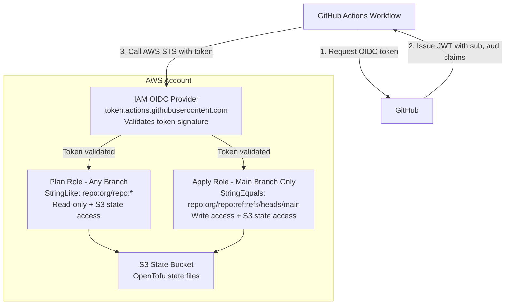

# AWS GitHub Pipelines Bootstrap Stack

## Overview

This Terragrunt stack bootstraps AWS infrastructure for GitHub Actions with OIDC authentication. It creates all necessary AWS resources to enable secure, keyless authentication from GitHub Actions workflows to your AWS account for [Gruntwork Pipelines](https://www.gruntwork.io/platform/pipelines).

## What This Stack Creates

### OIDC Provider

- IAM OpenID Connect provider for GitHub Actions

### Plan Role (Read-Only Operations)

- IAM role for running Terragrunt plans
- Uses `StringLike` condition (allows any branch on a given repository to assume the role)
- Default IAM policy for read-only operations (state-only access by default)

### Apply Role (Read-Write Operations)

- IAM role for running Terragrunt applies & destroys
- Uses `StringEquals` condition (only specified branch)
- IAM policy that allows for S3 state bucket access
- Default IAM policy for resource management (state-only access by default)

## Usage

Read the [official Gruntwork Pipelines installation guide](https://docs.gruntwork.io/2.0/docs/pipelines/installation/addingnewrepo) for usage instructions.

## Values

### Required

| Name | Description | Example |
|------|-------------|---------|
| `state_bucket_name` | S3 bucket for OpenTofu state | `my-tofu-state` |
| `github_org_name` | GitHub organization or username | `my-org` |
| `github_repo_name` | GitHub repository name | `infrastructure` |

### Optional

| Name | Description | Default |
|------|-------------|---------|
| `terragrunt_scale_catalog_url` | URL of this catalog | `github.com/gruntwork-io/terragrunt-scale-catalog` |
| `terragrunt_scale_catalog_ref` | Git ref to use | `main` |
| `oidc_resource_prefix` | Prefix for IAM resources | `pipelines` |
| `github_token_actions_domain` | GitHub Actions token domain | `token.actions.githubusercontent.com` |
| `github_server_domain` | GitHub server domain (for Enterprise) | `github.com` |
| `oidc_provider_url` | Full OIDC provider URL | `https://token.actions.githubusercontent.com` |
| `client_id_list` | OIDC client IDs | `["sts.amazonaws.com"]` |
| `deploy_branch` | Branch allowed to apply | `main` |
| `sub_key` | Subject claim key | `token.actions.githubusercontent.com:sub` |
| `sub_plan_value` | Subject for plan role (wildcard) | `repo:ORG/REPO:*` |
| `sub_apply_value` | Subject for apply role (specific) | `repo:ORG/REPO:ref:refs/heads/main` |
| `plan_iam_policy` | Custom plan policy JSON | See default below |
| `apply_iam_policy` | Custom apply policy JSON | See default below |

### Default IAM Policies

Both plan and apply roles get access to the state bucket by default:

```json
{
  "Version": "2012-10-17",
  "Statement": [
    {
      "Sid": "AllowCreateAndListS3ActionsOnSpecifiedBucket",
      "Effect": "Allow",
      "Action": [
        "s3:ListBucket",
        "s3:GetBucketVersioning",
        "s3:GetBucketAcl",
        "s3:GetBucketLogging",
        "s3:CreateBucket",
        "s3:PutBucketPublicAccessBlock",
        "s3:PutBucketTagging",
        "s3:PutBucketPolicy",
        "s3:PutBucketVersioning",
        "s3:PutEncryptionConfiguration",
        "s3:PutBucketAcl",
        "s3:PutBucketLogging",
        "s3:GetEncryptionConfiguration",
        "s3:GetBucketPolicy",
        "s3:GetBucketPublicAccessBlock",
        "s3:PutLifecycleConfiguration",
        "s3:PutBucketOwnershipControls"
      ],
      "Resource": "arn:aws:s3:::YOUR-STATE-BUCKET"
    },
    {
      "Sid": "AllowGetAndPutS3ActionsOnSpecifiedBucketPath",
      "Effect": "Allow",
      "Action": [
        "s3:PutObject",
        "s3:GetObject"
      ],
      "Resource": "arn:aws:s3:::YOUR-STATE-BUCKET/*"
    }
  ]
}
```

**Note**: You'll need to add additional permissions for managing your actual infrastructure.

## Stack Architecture



## Security Considerations

### Branch Protection

The apply role is restricted to the `deploy_branch` (default: `main`). Ensure you have branch protection rules:

- Require pull request reviews
- Require status checks to pass
- Restrict who can push

### Least Privilege

The default policies only grant S3 state access.

Only add the permissions you need, and only on the resources each role needs to access (read-only for plan, read-write for apply).

## Outputs

| Name | Description |
|------|-------------|
| apply_iam_policy.arn | ARN of the IAM policy for apply role |
| apply_iam_role.arn | ARN of the IAM role for apply operations |
| apply_iam_role.name | Name of the IAM role for apply operations |
| oidc_provider.arn | ARN of the GitHub Actions OIDC provider |
| plan_iam_policy.arn | ARN of the IAM policy for plan role |
| plan_iam_role.arn | ARN of the IAM role for plan operations |
| plan_iam_role.name | Name of the IAM role for plan operations |

## Related Documentation

- [GitHub Actions OIDC Guide](https://docs.github.com/en/actions/deployment/security-hardening-your-deployments/configuring-openid-connect-in-amazon-web-services)
