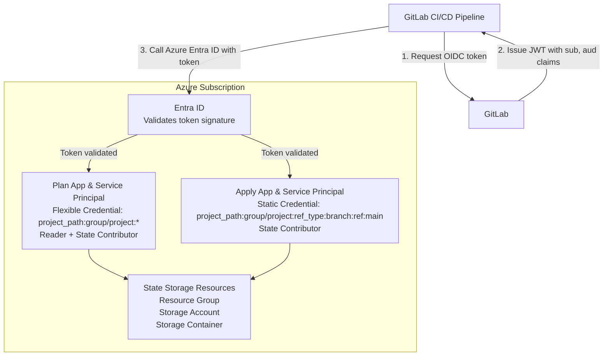

# Azure GitLab Pipelines Bootstrap Stack

## Overview

This Terragrunt stack bootstraps Azure infrastructure for GitLab CI/CD with OIDC authentication. It creates all necessary Azure resources to enable secure, keyless authentication from GitLab pipelines to your Azure subscription for [Gruntwork Pipelines](https://www.gruntwork.io/platform/pipelines).

## What This Stack Creates

### State Storage Resources

- Azure Resource Group for state management
- Azure Storage Account for OpenTofu state
- Storage Container for state files

### OIDC Resources for Plan Operations

- Entra ID Application for plan operations
- Service Principal for the application
- Flexible Federated Identity Credential (allows any branch on a given project to assume the role)
- Default Reader role assignment at subscription level
- Default Contributor role assignment to state storage

### OIDC Resources for Apply Operations

- Entra ID Application for apply operations
- Service Principal for the application
- Static Federated Identity Credential (main branch only)
- Default Contributor role assignment to state storage

## Usage

Read the [official Gruntwork Pipelines installation guide](https://docs.gruntwork.io/2.0/docs/pipelines/installation/addingnewrepo) for usage instructions.

## Values

### Required

| Name | Description | Example |
|------|-------------|---------|
| `location` | Azure region for resources | `East US` |
| `state_resource_group_name` | Resource group for state storage | `tofu-state-rg` |
| `state_storage_account_name` | Storage account name (globally unique) | `tfstate12345678` |
| `gitlab_group_name` | GitLab group name | `my-group` |
| `gitlab_project_name` | GitLab project name | `infrastructure` |

### Optional

| Name | Description | Default |
|------|-------------|---------|
| `terragrunt_scale_catalog_url` | URL of this catalog | `github.com/gruntwork-io/terragrunt-scale-catalog` |
| `terragrunt_scale_catalog_ref` | Git ref to use | `main` |
| `state_storage_container_name` | Container name for state files | `tfstate` |
| `oidc_resource_prefix` | Prefix for Entra ID resources | `pipelines` |
| `gitlab_server_domain` | GitLab server domain | `gitlab.com` |
| `audiences` | OIDC audiences | `["api://AzureADTokenExchange"]` |
| `issuer` | OIDC issuer URL | `https://gitlab.com` |
| `deploy_branch` | Branch allowed for applies | `main` |
| `plan_service_principal_to_sub_role_definition_assignment` | Role for plan SP at subscription level | `Reader` |
| `plan_service_principal_to_state_role_definition_assignment` | Role for plan SP on state storage | `Contributor` |
| `apply_service_principal_to_state_role_definition_assignment` | Role for apply SP on state storage | `Contributor` |

## Stack Architecture



## Federated Credentials

### Plan (Flexible - Any Branch)

Uses a **flexible federated identity credential** with claim matching:

```text
claims['sub'] matches 'project_path:my-group/my-project:*'
```

This allows plans from:

- Any branch
- Merge requests

**Note**: Requires Azure CLI (`az rest` command) due to Beta API usage.

### Apply (Static - Main Branch Only)

Uses a **static federated identity credential** with exact subject:

```text
subject: project_path:my-group/my-project:ref_type:branch:ref:main
```

This only allows applies from the `main` branch.

## Security Considerations

### Branch Protection

The apply role is restricted to the `deploy_branch` (default: `main`). Ensure you have branch protection rules:

- Require merge request approvals
- Require pipeline to succeed
- Restrict who can push

### Least Privilege

By default, the stack grants minimal permissions (Reader for plan subscription access, Contributor for state storage).

Only add the permissions you need, and only on the resources each role needs to access (read-only for plan, read-write for apply).

## Outputs

| Name | Description |
|------|-------------|
| plan_app.client_id | Client ID of the plan application |
| plan_app.id | Object ID of the plan application |
| plan_service_principal.object_id | Object ID of the plan service principal |
| apply_app.client_id | Client ID of the apply application |
| apply_app.id | Object ID of the apply application |
| apply_service_principal.object_id | Object ID of the apply service principal |
| resource_group.name | Name of the state storage resource group |
| storage_account.id | ID of the state storage account |

## Related Documentation

- [GitLab CI/CD with Azure](https://docs.gitlab.com/ee/ci/cloud_deployment/#configure-openid-connect-with-azure)

