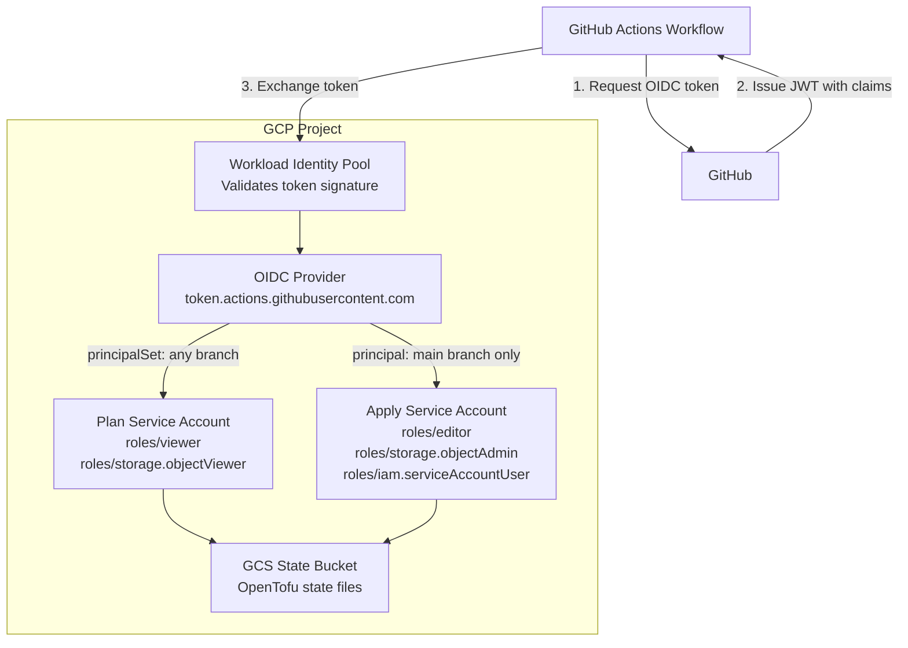

# GCP GitHub Pipelines Bootstrap Stack

## Overview

This Terragrunt stack bootstraps GCP infrastructure for GitHub Actions with OIDC authentication using Workload Identity Federation. It creates all necessary GCP resources to enable secure, keyless authentication from GitHub Actions workflows to your GCP project for [Gruntwork Pipelines](https://www.gruntwork.io/platform/pipelines).

## What This Stack Creates

### Workload Identity Pool & Provider

- Workload Identity Pool for GitHub Actions
- OIDC provider configured for GitHub's token issuer
- Attribute mapping for GitHub token claims

### Plan Service Account (Read-Only Operations)

- Service account for running Terragrunt plans
- Workload Identity binding using `principalSet` (allows any branch/PR from the repository)
- Default IAM roles: `roles/viewer`, `roles/storage.objectViewer`

### Apply Service Account (Read-Write Operations)

- Service account for running Terragrunt applies & destroys
- Workload Identity binding using `principal` (restricted to specific branch)
- Default IAM roles: `roles/editor`, `roles/storage.objectAdmin`, `roles/iam.serviceAccountUser`

## Usage

Read the [official Gruntwork Pipelines installation guide](https://docs.gruntwork.io/2.0/docs/pipelines/installation/addingnewrepo) for usage instructions.

## Values

### Required

| Name | Description | Example |
|------|-------------|---------|
| `project_id` | GCP project ID | `my-gcp-project` |
| `project_number` | GCP project number (numeric) | `123456789012` |
| `github_org_name` | GitHub organization or username | `my-org` |
| `github_repo_name` | GitHub repository name | `infrastructure` |

### Optional

| Name | Description | Default |
|------|-------------|---------|
| `terragrunt_scale_catalog_url` | URL of this catalog | `github.com/gruntwork-io/terragrunt-scale-catalog` |
| `terragrunt_scale_catalog_ref` | Git ref to use | `v1.2.0` |
| `oidc_resource_prefix` | Prefix for resources | `pipelines` |
| `github_token_actions_domain` | GitHub Actions token domain | `token.actions.githubusercontent.com` |
| `issuer` | Full OIDC issuer URL | `https://token.actions.githubusercontent.com` |
| `deploy_branch` | Branch allowed to apply | `main` |
| `workload_identity_pool_id` | Pool ID | `pipelines-github-pool` |
| `workload_identity_pool_provider_id` | Provider ID | `pipelines-github-provider` |
| `attribute_mapping` | Custom attribute mapping | See defaults below |
| `attribute_condition` | CEL expression for auth | `assertion.repository == 'org/repo'` |
| `plan_roles` | IAM roles for plan | `["roles/viewer", "roles/storage.objectViewer"]` |
| `apply_roles` | IAM roles for apply | `["roles/editor", "roles/storage.objectAdmin", "roles/iam.serviceAccountUser"]` |

### Default Attribute Mapping

```hcl
{
  "google.subject"             = "assertion.sub"
  "attribute.actor"            = "assertion.actor"
  "attribute.repository"       = "assertion.repository"
  "attribute.repository_owner" = "assertion.repository_owner"
  "attribute.ref"              = "assertion.ref"
}
```

## Stack Architecture



## GitHub Actions Workflow Configuration

To use these credentials in your GitHub Actions workflow:

```yaml
jobs:
  plan:
    permissions:
      contents: read
      id-token: write

    steps:
      - uses: google-github-actions/auth@v2
        with:
          workload_identity_provider: projects/${{ vars.GCP_PROJECT_NUMBER }}/locations/global/workloadIdentityPools/pipelines-github-pool/providers/pipelines-github-provider
          service_account: pipelines-plan@${{ vars.GCP_PROJECT_ID }}.iam.gserviceaccount.com

      - uses: google-github-actions/setup-gcloud@v2

      - run: terragrunt plan
```

## Security Considerations

### Branch Protection

The apply service account is restricted to the `deploy_branch` (default: `main`). Ensure you have branch protection rules:

- Require pull request reviews
- Require status checks to pass
- Restrict who can push

### Least Privilege

The default roles provide broad access. For production, consider using custom roles with only the specific permissions needed:

```hcl
plan_roles = [
  "roles/viewer",
  "roles/storage.objectViewer",
]

apply_roles = [
  # Instead of roles/editor, use specific roles:
  "roles/compute.admin",           # If managing Compute Engine
  "roles/container.admin",         # If managing GKE
  "roles/storage.objectAdmin",     # For state management
  "roles/iam.serviceAccountUser",  # For impersonation
]
```

### Attribute Condition

The default attribute condition restricts authentication to a single repository. You can customize this:

```hcl
# Allow multiple repositories
attribute_condition = "assertion.repository_owner == 'my-org'"

# Allow specific repositories
attribute_condition = "assertion.repository in ['my-org/repo1', 'my-org/repo2']"
```

## Outputs

| Name | Description |
|------|-------------|
| `workload_identity_pool.id` | ID of the Workload Identity Pool |
| `workload_identity_pool.name` | Name of the Workload Identity Pool |
| `workload_identity_pool_provider.id` | ID of the OIDC provider |
| `plan_service_account.email` | Email of the plan service account |
| `apply_service_account.email` | Email of the apply service account |

## Related Documentation

- [GitHub Actions OIDC with GCP](https://docs.github.com/en/actions/deployment/security-hardening-your-deployments/configuring-openid-connect-in-google-cloud-platform)
- [GCP Workload Identity Federation](https://cloud.google.com/iam/docs/workload-identity-federation)
- [google-github-actions/auth](https://github.com/google-github-actions/auth)
